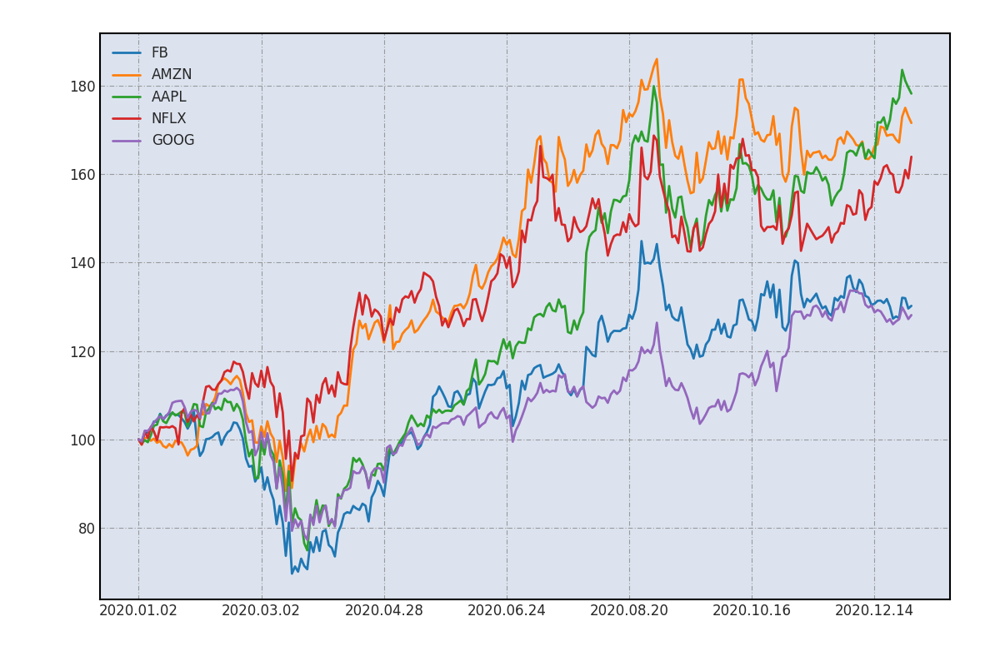

# python-for-finance

The work in this repo is guided by [Derek Banas'](https://www.youtube.com/c/derekbanas) playlist of YouTube tutorials on [Python for Finance](https://youtube.com/playlist?list=PLGLfVvz_LVvTHOWIEBAl-YOr_FC8lRmWX). His work is also hosted on Github [here](https://github.com/derekbanas/Python4Finance). Derek used a Jupyter notebook, but I wanted to work in VSCode and structure the code in my own way - due to running this code without a Jupyter notebook and in WSL (Windows Subsystem for Linux), which lacks a GUI, I specifically had to modify my approach to outputting plots by saving them in the `plots` folder. Additionally, since I'd like to develop a front-end webapp to pair with the python backend, I'm building out additional logic and adding extra detail to the plots. My code is also split into separate files to make writing and maintaining it more manageable.

My motiviation for following these tutorials is to gain familiarity with the stock market, practice my python development, and expand my data science skillset.

Technologies:
- python
    - matplotlib
    - numpy
    - pandas
    - pyramid

To run:
```
virtualenv myvenv
source myvenv/bin/activate

pip install -r requirements.txt

python src/main.py
```
CSV's will be saved to the `data` folder, plots will be saves to the `plots` folder.

Example plot showing how much value per stock option you would have after 1 year if you invested $100 in any of of FB, AMZN, AAPL, NFLX, GOOG.



Future goals:
- implement a user-friendly web-app to make use of the python analysis backend
